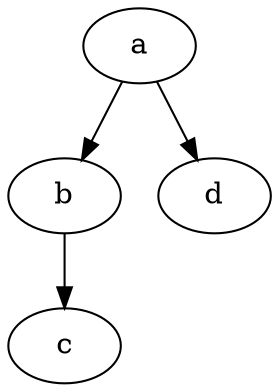
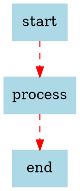
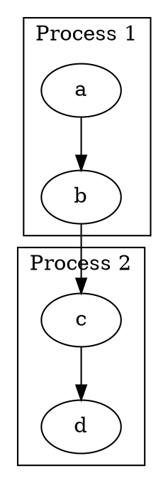

# Graphviz Package - AI Assistant Guidelines

This document provides specific guidance for working with the `@hpcc-js/wasm-graphviz` package.

## Package Overview

Provides WebAssembly version of [Graphviz](https://graphviz.org/) for creating graph visualizations in web browsers and Node.js.

### Key Features
- **Multiple Layout Engines**: dot, neato, fdp, sfdp, circo, twopi, osage, patchwork
- **Multiple Output Formats**: SVG, DOT, JSON, Plain text
- **Image Support**: Can embed external images in graphs
- **Browser & Node.js Compatible**: Works in both environments

## Package Structure

```
packages/graphviz/
├── src/
│   ├── index.ts          # Package entry point
│   ├── graphviz.ts       # Main Graphviz class implementation
│   └── __package__.ts    # Package metadata
├── src-cpp/              # C++ Graphviz source
│   ├── main.cpp          # C++ implementation
│   ├── main.hpp          # C++ headers
│   └── main.idl          # WebIDL bindings
├── tests/                # Test files
│   ├── graphviz.spec.ts  # Main tests
│   ├── worker.*.spec.ts  # Web Worker tests
│   └── dot001.js         # Test data
└── package.json          # Package configuration
```

## API Overview

### Main Class
```typescript
export class Graphviz {
    static async load(): Promise<Graphviz>
    
    // Primary layout method
    layout(dot: string, format?: Format, engine?: Engine, options?: GraphvizOptions): string
    
    // Convenience methods
    dot(dot: string, options?: GraphvizOptions): string  // SVG output with dot engine
    circo(dot: string, options?: GraphvizOptions): string
    fdp(dot: string, options?: GraphvizOptions): string
    neato(dot: string, options?: GraphvizOptions): string
    osage(dot: string, options?: GraphvizOptions): string
    patchwork(dot: string, options?: GraphvizOptions): string
    sfdp(dot: string, options?: GraphvizOptions): string
    twopi(dot: string, options?: GraphvizOptions): string
    
    // Utility methods
    version(): string
}
```

### Types and Enums
```typescript
// Output formats
type Format = "svg" | "dot" | "json" | "dot_json" | "xdot_json" | "plain" | "plain-ext" | "canon"

// Layout engines  
type Engine = "circo" | "dot" | "fdp" | "sfdp" | "neato" | "osage" | "patchwork" | "twopi" | "nop" | "nop2"

// Image support for external images
interface Image {
    path: string;
    width: string;
    height: string;
}

interface GraphvizOptions {
    images?: Image[];
    yInvert?: boolean;
    nop?: number;
}
```

## Usage Patterns

### Basic Usage
```typescript
import { Graphviz } from "@hpcc-js/wasm-graphviz";

const graphviz = await Graphviz.load();
const svg = graphviz.dot('digraph G { Hello -> World }');
```

### With Images
```typescript
const svg = graphviz.layout(
    'digraph { a[image="https://example.com/image.png"]; }', 
    "svg", 
    "dot", 
    { 
        images: [{ 
            path: "https://example.com/image.png", 
            width: "272px", 
            height: "92px" 
        }] 
    }
);
```

### Different Engines
```typescript
// Force-directed layouts
const fdp_svg = graphviz.fdp('graph G { a -- b -- c }');
const neato_svg = graphviz.neato('graph G { a -- b -- c }');

// Hierarchical layouts  
const dot_svg = graphviz.dot('digraph G { a -> b -> c }');

// Circular layouts
const circo_svg = graphviz.circo('graph G { a -- b -- c -- d -- a }');
```

## Testing Patterns

### Standard Tests
```typescript
import { describe, it, expect } from "vitest";
import { Graphviz } from "@hpcc-js/wasm-graphviz";

describe("Graphviz", () => {
    it("loads successfully", async () => {
        const graphviz = await Graphviz.load();
        expect(graphviz).toBeDefined();
    });

    it("generates SVG", async () => {
        const graphviz = await Graphviz.load();
        const svg = graphviz.dot('digraph G { a -> b }');
        expect(svg).toContain('<svg');
        expect(svg).toContain('</svg>');
    });
});
```

### Browser vs Node.js Tests
- **Browser tests**: Located in `*.browser.spec.ts`
- **Node.js tests**: Regular `*.spec.ts` files
- **Worker tests**: Test usage in Web Workers

## Common DOT Language Patterns

### Basic Directed Graph


### Styled Nodes and Edges


### Subgraphs/Clusters


## C++ Integration

### WebIDL Bindings (main.idl)
```webidl
interface Graphviz {
    void Graphviz();
    DOMString layout([Const] DOMString src, [Const] DOMString format, [Const] DOMString engine);
    DOMString version();
};
```

### C++ Implementation Notes
- Uses Graphviz C libraries compiled with Emscripten
- Memory management handled automatically
- Thread-safe for single-threaded JavaScript environment

## Debugging and Troubleshooting

### Common Issues
1. **Invalid DOT syntax**: Check DOT language syntax
2. **Missing images**: Ensure image URLs are accessible and dimensions provided
3. **Large graphs**: May cause memory issues in browser
4. **Engine limitations**: Some engines work better with specific graph types

### Debug Output
```typescript
// Enable verbose output (if supported)
const graphviz = await Graphviz.load({ debug: true });
```

### Performance Considerations
- Large graphs (>1000 nodes) may be slow
- SVG output can be large for complex graphs
- Consider using simpler engines (nop, nop2) for layout-only operations

## AI Assistant Guidelines

### When Modifying This Package
1. **Understand DOT language**: Familiarize yourself with Graphviz DOT syntax
2. **Test with multiple engines**: Different engines have different characteristics
3. **Consider output formats**: SVG for display, JSON for data processing
4. **Handle errors gracefully**: Invalid DOT should not crash the application
5. **Memory awareness**: Large graphs can consume significant memory

### Safe Modifications
- Adding new convenience methods following existing patterns
- Updating TypeScript types and interfaces
- Adding new test cases
- Documentation improvements

### Modifications Requiring C++ Changes
- Adding new Graphviz features not exposed via current bindings
- Performance optimizations
- Memory management improvements
- Adding new output formats or engines

### Testing Requirements
- Test with various DOT language constructs
- Test all supported engines and formats
- Test image embedding functionality
- Test error handling with invalid input
- Test both browser and Node.js environments